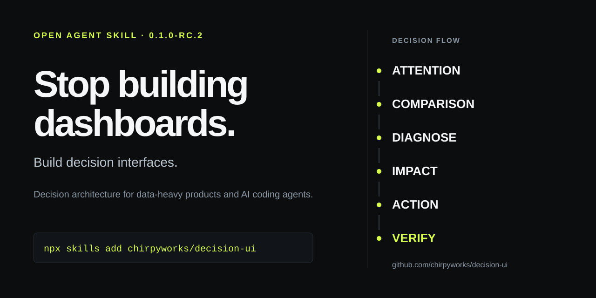

# Decision UI

**Stop building dashboards. Build decision interfaces.**

Decision UI is an open Agent Skill for data-heavy product design. It teaches coding agents to organize interfaces around the decision a person must make instead of defaulting to equal-weight KPI cards and decorative chart collections.

**[Live demo](https://chirpyworks.github.io/decision-ui/)** · **[Before / after field study](https://chirpyworks.github.io/decision-ui/saas-retention-before-after.html)** · **[Forking guide](docs/FORKING.md)**



```
Attention → Comparison → Cause → Impact → Action → Verification
```

Here, **Cause is a diagnostic question, not permission to claim causality**. The method distinguishes observed association, diagnostic evidence, working hypothesis and validated cause.

## Status

Current candidate: **0.1.0-rc.2 / pre-1.0**.

The public repository, format validation and installation paths are verified. Client-level activation and behavior are still being evaluated; see `docs/COMPATIBILITY.md`.

## Install

```bash
npx skills add chirpyworks/decision-ui
```

Verified non-interactive form:

```bash
npx skills@1.7.0 add chirpyworks/decision-ui --skill decision-ui -a <agent> -y
```

Install smoke tests pass for Claude Code, Codex, Cursor, Gemini CLI and GitHub Copilot targets. Installer success is not the same as behavior verification.

Canonical skill:

```
skills/decision-ui/SKILL.md
```

Fork-specific rules belong in:

```
skills/decision-ui/house-style.md
```

The core requires no API key, telemetry, runtime service or network request after installation.

## Before / after field study

Open the [live SaaS retention comparison](https://chirpyworks.github.io/decision-ui/saas-retention-before-after.html) or inspect its [source](examples/saas-retention-before-after.html). Both views use the exact facts from the [benchmark prompt](evals/prompts/saas-retention.md); only the information architecture changes.

This is a designed demonstration, not a measured agent benchmark or evidence of faster decisions. It does not invent account-level causes, renewal timing or intervention outcomes.


## Why this exists

Generated dashboards often look complete while leaving the reasoning to the user:

- every KPI gets the same visual weight,
- charts are selected for variety rather than analytical purpose,
- anomalies are highlighted without a path to action,
- exact lookup problems become charts,
- desktop layouts are merely stacked on mobile,
- stale or uncertain data looks as trustworthy as current data,
- temporal association is presented as cause.

Decision UI starts from the actor, decision, time horizon, consequence, evidence and available action, then selects hierarchy and visualization.

## Four operating modes

| Mode | Purpose |
| --- | --- |
| **BUILD** | Create a new decision interface from a brief, schema, dataset or product requirement. |
| **AUDIT** | Find the highest-impact structural problems before visual polish. |
| **REFRAME** | Keep the data and business goal, but replace metric-first IA with decision-first IA. |
| **CHART** | Choose or critique a visualization from the analytical question, not chart fashion. |

## The core test

Before drawing the page, complete:

> **The user opens this view because they need to decide ______ before ______.**

If that sentence cannot be completed, the interface is not ready to be designed.

## Default hierarchy

1. **Attention** — what requires attention now?
2. **Comparison** — compared with what baseline, target, cohort or prior period?
3. **Cause / diagnosis** — what evidence explains the change, and how strong is the causal support?
4. **Impact** — what happens if nothing changes?
5. **Action** — what can the user do next?
6. **Verification** — did the action improve the outcome?

Not every screen needs all six layers. Every layer that appears must earn its space.

## Anti-card-wall rule

Do not convert every metric, status or sentence into a card.

A card is justified when its boundary carries meaning: independent state, action, ownership, comparison or reusable interaction. Otherwise use layout, typography, spacing and alignment to create hierarchy.

## Chart rule

Choose charts by analytical question.

- Change over time → line / area / event timeline
- Compare categories → sorted bar / dot plot
- Target vs actual → bullet / variance bar
- Contribution to change → waterfall
- Rank causes → Pareto
- Distribution → histogram / box plot
- Relationship → scatter
- Flow → Sankey only when path magnitude matters
- Schedule → Gantt / interval timeline
- Process state → event or state timeline
- Exact lookup → table, not a chart

See `skills/decision-ui/references/chart-selection.md`.

## Accessibility is part of decision integrity

Critical state and action must not depend on color alone, hover alone or a pointing device. Important chart meaning needs an accessible textual or tabular equivalent where appropriate.

See `skills/decision-ui/references/accessibility.md`.

## Proof across domains

Four explicitly synthetic field studies use the same rule: **same supplied facts, different information architecture**.

| Domain | Live field study | Source brief |
| --- | --- | --- |
| SaaS retention | [Before / after](https://chirpyworks.github.io/decision-ui/saas-retention-before-after.html) | [Example](examples/saas-retention.md) |
| Manufacturing operations | [Before / after](https://chirpyworks.github.io/decision-ui/manufacturing-operations-before-after.html) | [Example](examples/manufacturing-operations.md) |
| SRE incident response | [Before / after](https://chirpyworks.github.io/decision-ui/sre-incident-before-after.html) | [Example](examples/sre-incident.md) |
| Executive revenue / forecast | [Before / after](https://chirpyworks.github.io/decision-ui/executive-revenue-before-after.html) | [Example](examples/executive-revenue.md) |

These are designed demonstrations, not customer case studies or measured benchmark proof.

## Evaluation

The repository includes:
- `BENCHMARK.md` — comparison protocol,
- `evals/cases.md` — behavioral boundaries,
- `evals/manifest.json` — machine-readable evaluation contract,
- `evals/prompts/` — exact benchmark prompts.

The benchmark rule is: same agent/model version, same prompt, same data, fresh context, baseline vs Decision UI, raw outputs preserved.

Do not collapse a small evaluation set into unsupported claims of universal superiority.

## Forking

Keep upstream method close to:

```
skills/decision-ui/SKILL.md
skills/decision-ui/references/
```

Put organization-specific preferences in:

```
skills/decision-ui/house-style.md
```

That narrow customization surface is deliberate: fork for your team, keep the method upstream-compatible, and pull improvements with fewer conflicts.

See `docs/FORKING.md` for the low-conflict fork model.

## Repository structure

```
skills/
  decision-ui/
    SKILL.md
    house-style.md
    references/
evals/
  prompts/
examples/
site/
scripts/
docs/
  COMPATIBILITY.md
  FORKING.md
  RELEASING.md
.github/
README.md
BENCHMARK.md
LICENSE
CONTRIBUTING.md
SECURITY.md
SUPPORT.md
CODE_OF_CONDUCT.md
CHANGELOG.md
ROADMAP.md
```

## Validation

Repository policy:

```bash
python3 scripts/validate.py .
```

Agent Skills format:

```bash
skills-ref validate skills/decision-ui
```

CI also performs clean installation into five supported installer targets from the real public repository.

## Contributing, support and security

Read `CONTRIBUTING.md` before changing the core method. Use `docs/RELEASING.md` for release discipline, `SUPPORT.md` for support expectations, and `SECURITY.md` for sensitive reports.

Visual preference alone is not enough reason to change the shared method. Core changes should identify a recurring failure mode, user consequence, counterexample and evaluation case.

## License

MIT. Fork it, adapt it, ship it.
